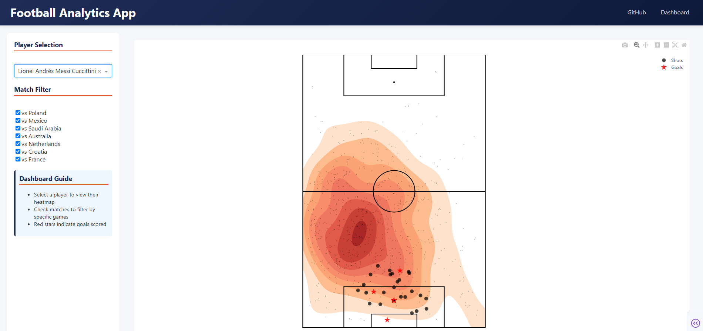

# Player Analytics Dashboard

A football player analytics platform built with Python, Dash, and PostgreSQL using StatsBomb data.

## Features
- Interactive player heatmaps
- Match filtering capabilities
- Real-time analytics dashboard

## Languages, Tools, and Libraries/Packages
       

## Main Dashboard

## Coming Soon
- Advanced player metrics (xG, xA, pass completion)
- Player Metrics Card
- & Many More
